# Eclipse
# Game Basic Information #

## Summary ##

**A paragraph-length pitch for your game.**

## Gameplay Explanation ##

**In this section, explain how the game should be played. Treat this as a manual within a game. It is encouraged to explain the button mappings and the most optimal gameplay strategy.**

**If you did work that should be factored in to your grade that does not fit easily into the proscribed roles, add it here! Please include links to resources and descriptions of game-related material that does not fit into roles here.**

# Main Roles #

Your goal is to relate the work of your role and sub-role in terms of the content of the course. Please look at the role sections below for specific instructions for each role.

Below is a template for you to highlight items of your work. These provide the evidence needed for your work to be evaluated. Try to have at least 4 such descriptions. They will be assessed on the quality of the underlying system and how they are linked to course content. 

*Short Description* - Long description of your work item that includes how it is relevant to topics discussed in class. [link to evidence in your repository](https://github.com/dr-jam/ECS189L/edit/project-description/ProjectDocumentTemplate.md)

Here is an example:  
*Procedural Terrain* - The background of the game consists of procedurally-generated terrain that is produced with Perlin noise. This terrain can be modified by the game at run-time via a call to its script methods. The intent is to allow the player to modify the terrain. This system is based on the component design pattern and the procedural content generation portions of the course. [The PCG terrain generation script](https://github.com/dr-jam/CameraControlExercise/blob/513b927e87fc686fe627bf7d4ff6ff841cf34e9f/Obscura/Assets/Scripts/TerrainGenerator.cs#L6).

You should replay any **bold text** with your relevant information. Liberally use the template when necessary and appropriate.

## User Interface- [TingweiLiu]

### Overall UI design

### Narrative board

### Save and Continue Button

### Packet Button Controller

## Movement/Physics - [Huilin Zhang]

**Describe the basics of movement and physics in your game. Is it the standard physics model? What did you change or modify? Did you make your movement scripts that do not use the physics system?**

### Player Movement
In the game, I use `PlayerController.cs` to implement movement for the main player. When the script is first called, I set the `target frame rate` to 60 since games are played best at 60 fps, in other words, a rate of 60 frames per seconds. 

Then in every updates, I created two variables to keep track of whether the player is moving horizontally or vertically or both. Then modify the current player positoin [by adding the movement axis multiply by `MoveSpeed` per frame.](https://github.com/wenxi325/Eclipse/blob/af88556bd83cd9411c60bf9d565730843c7eec64/Assets/Scripts/PlayerController.cs#L30-L35) That way, regardless of how player is moving, whether he is moving up-left, down-right, or anything else, the system is able to detect by using `Input.GetAxis`. Since I'm updating both horizontal and vertical axes each time, the system will be able to handle all movement situations.

### Camera Movement
There are two camera movement scripts, one is for small rooms or small scenes, another one is for the larger scene, in this case, the lobby. The `CameraFollow.cs` and `CameraFollowPlayer.cs` will be responsible for the camera movement.

The `CameraFollow.cs` doesn't have any update functions because it is responsible for small scenes that the player can view the entire scene/room without moving the main character around. As a result, I set the camera starting position to be the same as main character's current position and not updating the camera anymore. https://github.com/wenxi325/Eclipse/blob/af88556bd83cd9411c60bf9d565730843c7eec64/Assets/Scripts/CameraFollow.cs#L27

The `CameraFollowPlayer.cs` will have a slight difference with the previous camera script. I initialize the camera starting position to be same as the player's position. However, since the script is for larger scenes, where the player cannot view the complete scene and need to move around to see the complete room view, the script will have an update function that move as the player moves. In `Update()`, I first detect if the player has moved, then record the new position except the z-axis. Lastly, use the function I learned in exercise 2 (`Vector3.lerp()`) to make camera moves along with the player. https://github.com/wenxi325/Eclipse/blob/af88556bd83cd9411c60bf9d565730843c7eec64/Assets/Scripts/CameraFollowPlayer.cs#L35-L37

### Main Character Transport
###### **Overall**
In order to perform character transport properly, I decided to separate 6 different scenes, each scene represents one room and the main character will be able to transport via doors.

To achieve that goal, the door prefabs must have a collider and disable *isTrigger* so that the main character can collide with the door. In this case, `Box Collider 2D` will be sufficient since the door is rectangle shape. Moreover, I created 13 more tags so that I can keep track of which door the player has collided with. Below is an example of doors that can transport player back to the dorm room:

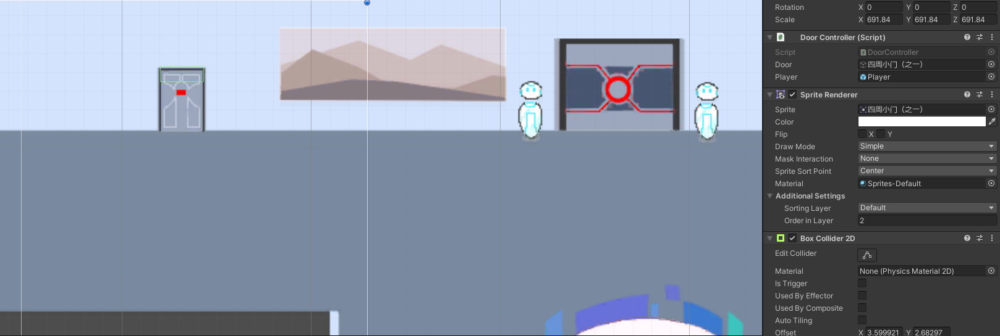

As you can see, I set the box collider at the top of the door instead of fill out the entire door. That is because if I set collider's shape to be the same as the door, the player will immedately be tranported when he just touched door's bottom line. However, the player will be transported only when he steps into the door. Hence, I leave some spaces for player to move around and transport him when he really tries to enter the door.

###### **Implementation (Script)**
The `DoorController.cs` script in the `Doors` folder manages the door transportations. Inside the script, depending on the tag that current door has, will switch to different scenes by modifying the build scene index. I have created 6 scenes and added them to the build settings in order when I created them. Below is a screenshot of the build settings in our game:
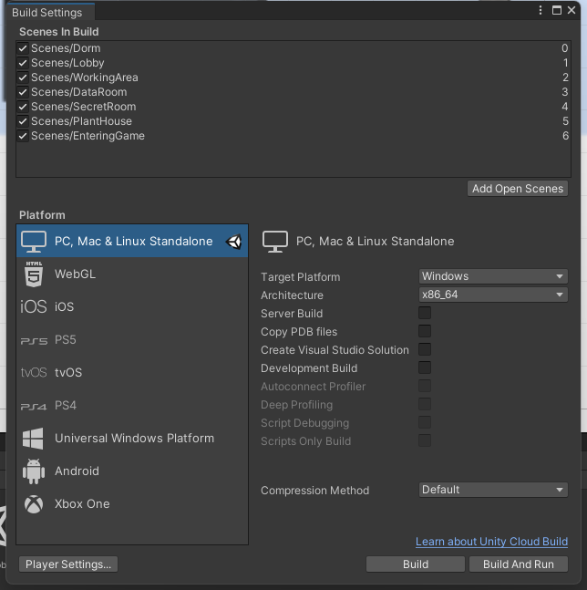

Here is an example of how my script will work: Let's say the player enters a door that has a tag "Lobby_up_right", indicates that he is trying to enter the up-right door in the lobby. In our settings, the up-right lobby door is connected to the data room. The `Lobby` scene is at *level 1* while the `DataRoom` scene is at *level 3*, so I will add 2 to the current `buildIndex` so that it gets to the `DataRoom` scene.
https://github.com/

 325/Eclipse/blob/a9165cc5ffed2a679cfe4389daff6c5e2e0f9dd0/Assets/Scripts/Doors/DoorController.cs#L75-L77
On the other hand, if the player is trying to go back to the `Lobby` from `DataRoom`, subtract 2 from the `buildIndex` to reach *level 1*.https://github.com/wenxi325/Eclipse/blob/a9165cc5ffed2a679cfe4389daff6c5e2e0f9dd0/Assets/Scripts/Doors/DoorController.cs#L84-L86

###### **Exit Button**
There is an exit button at the upper right corner which will be back to the very beginning entering scene. For simplicity, I didn't create a separate script to manage the exit button. Instead, I assign all the exit buttons in all scenes with a *exit_btn* tag. Inside the function `OnMouseDown()`, if the *exit_btn* tag is clicked, load the `EnteringGame` scene immediately no matter where the player is currently at.https://github.com/wenxi325/Eclipse/blob/a9165cc5ffed2a679cfe4389daff6c5e2e0f9dd0/Assets/Scripts/Doors/DoorController.cs#L51-L53

Similar to the doors, the exit buttons also have a `Box Collider 2D` but enable the *isTrigger* option. Here is an example of the exit button:
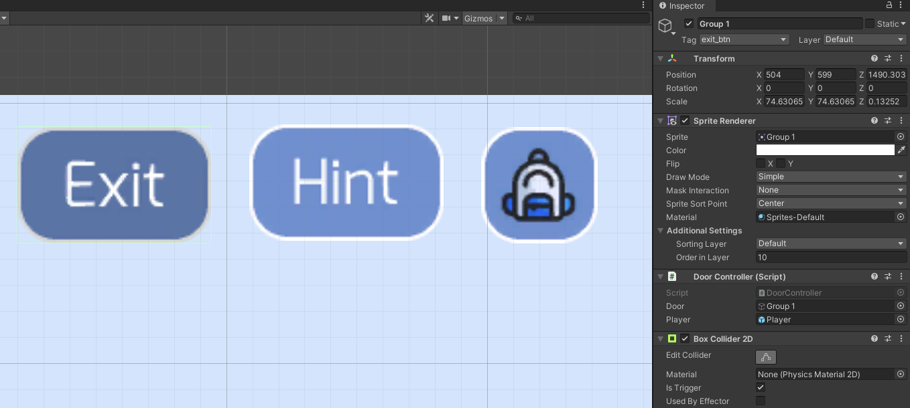

## Animation and Visuals

**List your assets including their sources and licenses.**

**Describe how your work intersects with game feel, graphic design, and world-building. Include your visual style guide if one exists.**

## Input -[Keying Liu]

**Describe the default input configuration.**
The default input configuration for this game will be using arrow key: up, down, left, right. Or the WASD on keyboard to control the player to move around.

### Player Movement

I worked out the script `PlayerController.cs` script with Huilin Zhang together. After received the initial version for player camera controller and movement script, I edit the the player controller by following the outside source https://chowdera.com/2021/12/202112270602142589.html, at which will first gather the current player position by using `Input.GetAxis("Horizontal");` and `Input.GetAxis("Vertical");`, then setup the new position by factor in the choosen player moving speed and the `Time.deltaTime` to make it smooth.

https://github.com/wenxi325/Eclipse/blob/17d13abc8b85a79d5108f5ff1197ef4128559a04/Assets/Scripts/PlayerController.cs#L20-L35

### Player Collision

I worked out the initial version for player collision in unity, which attach the `capusule collider 2D` for objects in the first room.

I used both vertical or horizontal mode to make sure the collider field fit the object, such that when player moves close to it, it will not overlap with the object, like the box/bed the player woke up at, the controller panel when player come close by.
The newer version for player collision is then implemented and improved by Huilin Zhang to extend it to other room.

### Inventory system

For inventory system, I created `items.cs` and `Inventory.cs` and `CollectItem.cs`. The `items.cs` serves as class to store property for each collectable object and to monitor their state.
https://github.com/wenxi325/Eclipse/blob/17d13abc8b85a79d5108f5ff1197ef4128559a04/Assets/Scripts/Item.cs#L7-L36
for each scriptable/collectable object, it has property of name, order number and amount. Where the amount is set to defaul of 1, assuming each object is unique beside specially situation like ID Cards, where we have total of five ID cards for all five people in the room. The order number represents which object we are collecting in the game. The game comes with a-j planned items, corresponding to 10 object in total. So that we can better manage which object the player currently have in the hand to assist with puzzle solving. 

I initially wanted to created separate class for each item, just like `IDCard.cs` to keep more unique and detailed information for each object, however I ened up with a more general approach by creating a class of `Item.cs` to better adopt to various object.

The `Inventory.cs` file then stores a list of class `<Item>`  that serves as a backpack to manage what player have in total. I was trying to make inventory accessable by clicking on the upper right corner backpack icon using `OnMouseDown()`, somehow it doesn't work, so I also added a `OnKeyDown(KeyCode.B)` on `Update()` such that when player press B on keyboard, the inventory will bring up to the screen to player.

 https://github.com/wenxi325/Eclipse/blob/17d13abc8b85a79d5108f5ff1197ef4128559a04/Assets/Scripts/Inventory.cs#L53-L72
  The inventory is presented in Text form, which will first read from the list, then print out the items in the list with property. The inventory will only be visiable when user press B or click the icon(icon failed).
  
  The inventory should be attached to the topright icon gameobject, and all other script should be able to access the content of the inventory by using 
  `GameObject.FindObjectOfType(typeof(Inventory)) as Inventory` 
  
  The inventory has add and delete item method that support the collection and usage of items in the inventory. The add and delte method will ensure that if the item does exist before deletion and the item doesn't exist before addition to avoid duplication or deletion of nonexisting item.
  
 ### Item Collection
 
 After the inventory is set up, I then created `CollectItem.cs` to help player gather object, and then store it into the inventory. This script should be attached to each gameobject that contains collectable items, with unique id which will be inputed in https://github.com/wenxi325/Eclipse/blob/17d13abc8b85a79d5108f5ff1197ef4128559a04/Assets/Scripts/CollectItem.cs#L14
 to represent each individual items. For example, for player to gather id card in the control panel, we simply attach the `CollectItem.cs` script to the ControlPanel game object. 

 
 Then by using collision detection to detect whether the player is close enough to collect item the that game object:
 https://github.com/wenxi325/Eclipse/blob/4e060832c1b3e980097e78c2d5e08409960020aa/Assets/Scripts/CollectItem.cs#L56-L72
 If the player is in range, a text with panel will come up on that says "Press C to collect item". 
 After C is pressed, the script will have switch statement to determine which item has been collected. For example, for the controll panel, we assign it with id:0, such that when collected, the script will create an item called `IDCard`, with `amount =5`, `and order=0`, then added to the inventory. 
 The example for collecting item and added to inventory is shown in the trailer. However, because of the technical difficulty, the script is not attached but only added to the file to avoid crashing with the dialog end.
  https://github.com/wenxi325/Eclipse/blob/2e8792f348b13b5ea0c1628f90c5b41cbbc112ec/Assets/Scripts/CollectItem.cs#L72-L81

**Add an entry for each platform or input style your project supports.**

### PuzzleTrigger
Just like the dialog trigger created by Tingwei Liu, I used the collision Trigger to detect if a puzzle is reached. The player can press `Key.Tab` to active the text box saying that it is now time to solve the puzzle, By plan, each puzzle should come with unique id, such that by using switch statment, the puzzleTrigger will know which puzzle should be directed to. https://github.com/wenxi325/Eclipse/blob/4e060832c1b3e980097e78c2d5e08409960020aa/Assets/Scripts/puzzleTrigger.cs#L12.

## Game Logic -[Wenxi Cai]

Designed the integration of all game systems(hierarchy, interface of different parts), as well as coordinate others work into the main project, and deciding on the Git-based workflow to avoid conflict. 

Please reference the game logic design to the file gameLogic.pdf (top-level of this repository).

# Sub-Roles

## Audio - [Huilin Zhang]

### List of Assets & Sources

**Adapted from "Electric Door Sound Effect HD: https://www.youtube.com/watch?v=LxzBlorJ8ec**
- OpenDoor.mp3

**Below are from https://www.bensound.com:**
- betterdays.mp3
- dreams.mp3
- EnterGame.mp3
- november.mp3
- relaxing.mp3
- sadday.mp3
- thelounge.mp3

### Background Music

###### Style / Theme
Our main story is relating to escape from a place, so the overall background music should not be energizing or hopeful. Instead, I think the genres or the moods that will best fit to our game will be suspenseful, acoustic, and ambient. As a result, I skip all the energetic and positive music when choosing the background music. I end up choosing music that is moderately slow and calm, some of them also give people a sense of staying in the aerospace.

###### Doors Sound Effects
For finding the sound effects for opening the door, I try to find them by including the word *electronic* since our background stories are all relevant to the future which is full of electronic devices. So the doors during that period of time will also be more "advanced" instead of wooden doors nowadays.

### Implementation of Audio System
There is a total of 7 different scenes, one for the game entrance, and the rest of them each representing a room. So I pick seven different background music to make the game more enjoyable and improve the game feel. In each scene, I create an empty object named `BGM` which stands for background music, and it contains an audio source component and applies the corresponding `AudioClip` to each of the audio sources. That way, the background music will be loaded for every scene change, along with distinct music. 
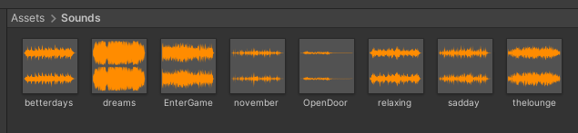

The implementation of doors opening sound effect is done in the `Dorm` scene by creating an empty object named `SoundManager`, attached with the `SoundManager.cs` script and an audio source component. Inside the script, I use the `DontDestroyOnLoad()` function to prevent the destruction of the sound instance for scene switches. Since all doors will have identical sound effects, I play the sound effect every time the main character enters or exits the door and perform a scene switch.
https://github.com/wenxi325/Eclipse/blob/8f57430afdbe6a958e7b04807eab52b631a0e8b2/Assets/Scripts/Doors/DoorController.cs#L34

## Gameplay Testing

**Add a link to the full results of your gameplay tests.**

**Summarize the key findings from your gameplay tests.**

## Narrative Design

**Document how the narrative is present in the game via assets, gameplay systems, and gameplay.** 
### Overall design of the game flow

I provide a basic flow of the game, Including the information included in the start up sheet, the choice diagram, the map of the whole game. I am also contributed to the designing of the puzzle. For example, in the dorm room, the player need to interact with each freezer to get enough information to match specific ID card to the freezer. 

### Specific Stroy

Almost all the prefab in our game are interactable. In this way, all those narratives will help player get the overall story layer by layer. I use the ink file, which is also attached in the unity asset story, to make script for different prefabs. I also include the button controller to detect user's choice. The return value by the button controller will connect with the input to compare whether the user solve the puzzle correctly

## Press Kit and Trailer

**Include links to your presskit materials and trailer.**
(press kit is made through google site)
https://sites.google.com/ucdavis.edu/ecplise/home?authuser=0

**Describe how you showcased your work. How did you choose what to show in the trailer? Why did you choose your screenshots?**

For the presskit, at first I was trying to use cyberduck, myDNS, and presskit() and presskit static html version on github to create presskit. However, due to installation difficulty and domain name issue and long loading time for w3school SPACE, I ended up using google site to create the press kit.

The Presskit consists of three tabs: Home, Trailer, Background, and Contact. The Home page contains screenshots for each room and some interesting UI such as the status in the main lobby. By providing a horizontal auto scrolling image gallery for all the screenshots in the main page, the user can eaily understand what the game is like, what is the genre, the visual design and to determine if they want to know more about the game quickly. Beside that, the Home page also contains short description for the game to conclude what would player expect to know about the game before playing.

**Home Page Cover**

**Home Page Image Gallery**

Using Image Gallery will save many spcae on the website, which prevent presenting too much information all at one time.

The presskit's Trailer page contain video from youtube for our game, as well as one paragraph to describe why I selected those components/elements in the trailer to better assist user to understand the trailer and the connection it has to the game.

The Background tab explains the story background for the game, and provided screenshot for the floor mapping of the game and the game flow expected to guide user have a better understanding of the game.

I also created a separate tab for contact information for the group beside having all the group members name at the footer for each page.

**Trailer**
The trailer is made through iMovie on Mac, and uploaded to youtube, then use it in the press kit website to allow user to directly watch the trailer on the website without being redirecting.
Link for trailer on youtube:
https://youtu.be/OSbZsvEJNbA 

The trailer in the iMovie is combined with clips of the game and screenshots, as well as some background music and sound effects that are provided by iMovie itself. And between the clips, I used transition effect and pur text with dark background to help smoothen the trailer to connect clips together.

For the trailer, I used a unverise gif as background to show that the concept of the game, or the background story, is somehow related to the outer space.
Then aftert the title "Ecplise" disappear, I choose to use text in first person narrative (Waking up, where am I?) to tell user that we - the player, just woke up and didn't know where we are, or who we are.
Then I used two transition effect for the first room, to create the effect of blinking eyes to show that the player just wake up.
Then I used a clip at which player walked to the door, combined with sound effect and text to show that the door is locked, implying that player needs to find a way out the escape the room, which somehow tell the audience that this game is a puzzle game.
After that, I used a new clip, at which player pick up IDcards from control panel, then successfully walk out the room because of the item he collects.

The main focus of the trailer is the part above at which focus on the beginning of the gameplay. I choose that part because I think for a puzzle solving game, the attractive part is to provide user with an interesting start of the story, tell them what is the situation now, and what is the struggle now. Instead of just having all the screenshots for the game in the trailer, only focuing on the beginning part will bring up player's curiosity.

After player walked out the first room, the pace of the trailer will go faster, with different clips of player walking in rooms, which represent the journey of solving puzzles and finding back memory. This portion comes with less detail because I don't want player to know everything about the game before play it. 

The final clip is player walking up to the control bar to open the gate to the outside world, I added heartbeat and footstep and door sound effects to create the excitment for the moment. However, there will be quite open ending so the final clip will lead to the end of the trailer.

At the end I add a credit page which shows every team member's main role and sub role as ending.

## Game Feel - [Huilin Zhang]

### Scenes Loading
###### **Small Scenes**
After receving all the artworks in *.psd* form, I load the all the items into Unity and ajust the scale of all the scenes until it looks comfortable to play. In other words, the small rooms can be fit into camera view and people can see the entire room settings without moving around. As a result, for small rooms, I find the best scale which is `563.1652`. Since the scenes are scaled up, the main character also needs to scale up. 
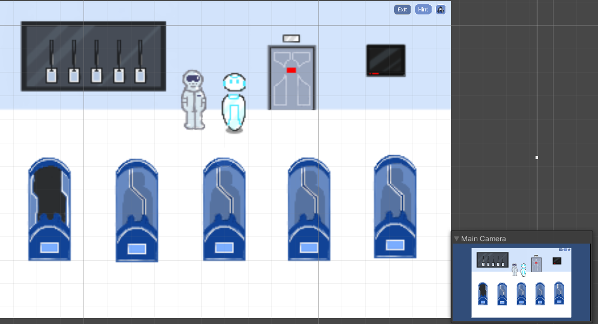

###### **Large Scene(Lobby)**
The lobby scene will not need that much scale up, instead, it only needs to scale up by `123.2818`. I got this number by comparing the player's size and the robot size in the lobby scene. The player is a little shorter than the robot:
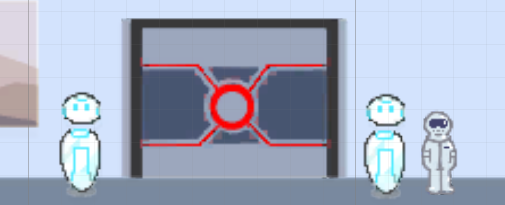

###### **Modify Colliders**
**Box Collider 2D**

Visually, it will look awkward if I don't modify all the collider shapes. For example, when the character walks around the dormant bin, he should be able to cross the dormant bin once his legs are below the bottom line of the dormant bin. 
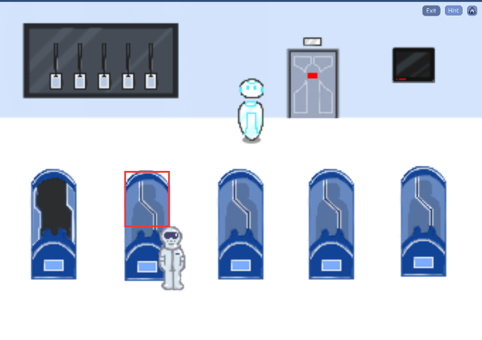

The red rectangle represents the modified collider shape, which cuts almost half of the dormant bin's height. In contrast, if the red rectangle has the same height as the dormant bin, the character will not be able to cross the dormant bins and will be weird visually. Similar to across the robots, since the character's layer order is higher than robots, the character will cover robot's part as he walk across them. As a result, adding a box collider to the robot that has a shape of robot's head will look reasonable.
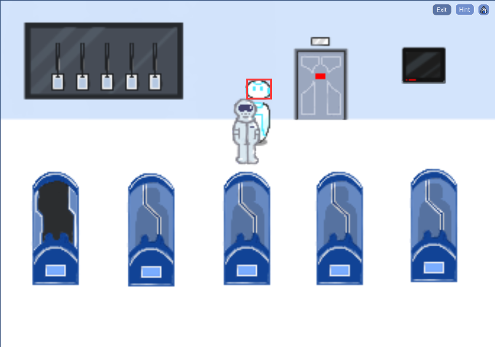

Box colliders can also be used to prevent the main character walk upon walls. In most of the rooms, I add a bunch box colliders on the wall so that the character cannot walk on the walls. The height of the box will be half of wall's height so that makes the character look like he is walking along the wall.
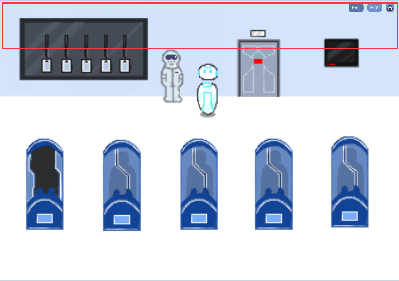

Another example of using box collider is all the control panels. Since the game is in 2D but all drawings are almost 3D. To make it visually reasonable, I modify the box collider as shown below:
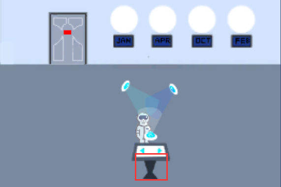
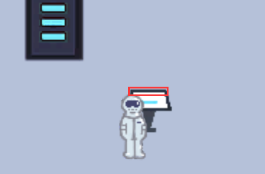

I have made two different visualizations of the two types of control panels. The first one's order layer is higher than the character so he can only walk at the back of the control panel. The second one's order layer is lower so the character can walk in front of it.

**Edge Collider 2D**

Without setting edges of the scenes, the character can go off the scene and lost in the entire space. As a result, *Edge Collider* plays a significant role in restricting the player to stay in place. In every scene excluding the `EnteringGame` scene, I create boundaries around the room by using *Edge Collider*. Below is an example of combining *Box Collider*(in red) and *Edge Collider*(in pink).
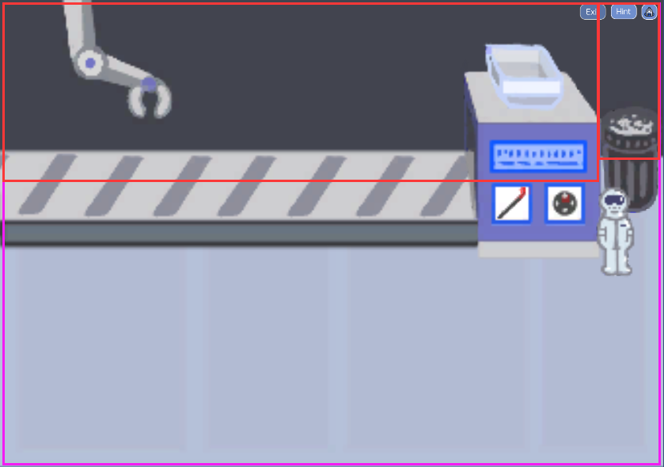

**Polygon Collider 2D**

The *Polygon Collider* is suitable for prefabs that are not in a regular shape. In this case, a semi-circle table is neither a rectangle nor a capsule. At this situation, a polygon collider will perfectly resolve the problem. I use 10 points and connect them together to trace a similar shape of semi-circle table. After applying the 2D visualization as mentioned previously, I need to leave some spaces for the character to walk along with the table. Below is the polygon collider I created for the table:
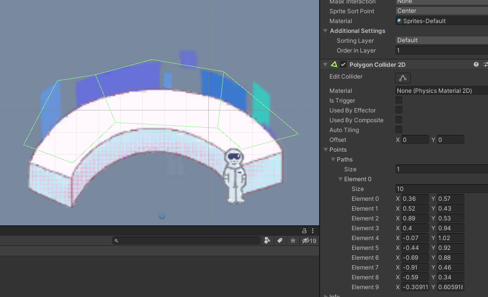
